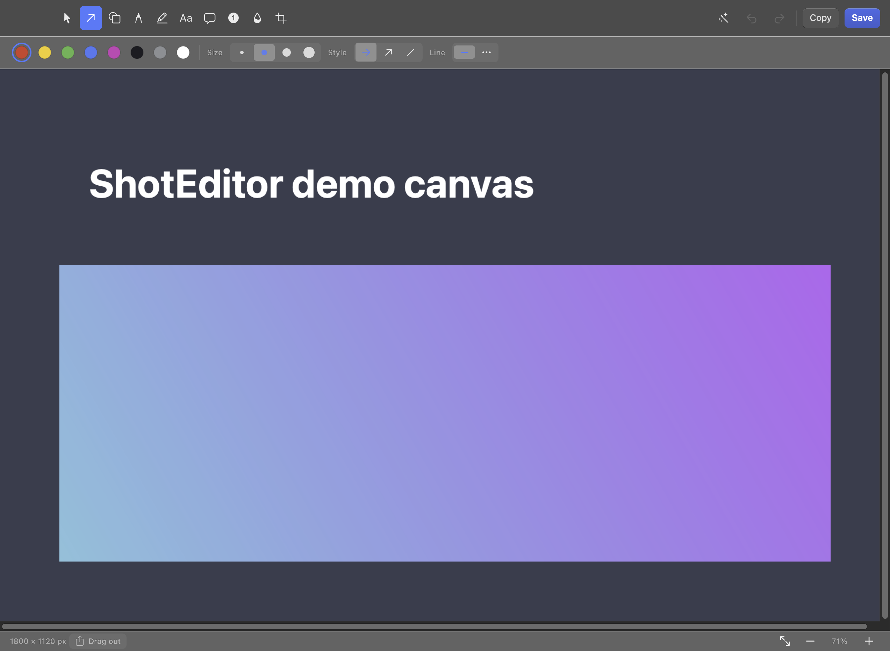
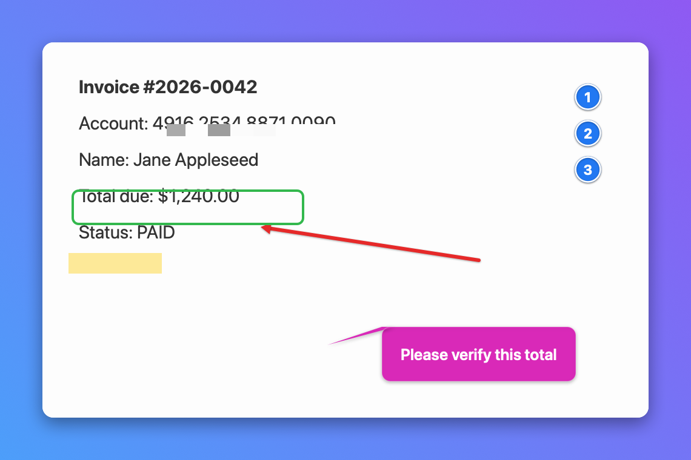

# ShotEditor


A fast, local-first macOS screenshot capture & annotation tool — **with no
cloud, account, sync, or telemetry**. Everything stays on your machine: save to
a file you pick, or copy to the clipboard.

Native **Swift + AppKit**, runs as a menu-bar agent (`LSUIElement`, no Dock
icon). Annotations are drawn with Core Graphics.



Annotate, redact, and beautify — then save, copy, or drag out:



## Contents

- [Install](#install)
- [Features](#features)
- [Keyboard shortcuts](#keyboard-shortcuts)
- [Build & run](#build--run)
- [Development](#development)
- [Tests](#tests)
- [License](#license)

## Install

1. Download `ShotEditor.dmg` from the [latest release](../../releases/latest).
2. Open the `.dmg` and drag **ShotEditor** into **Applications**.
3. First launch: **right-click** ShotEditor → **Open** → **Open**
   (the build is not notarized, so macOS asks once).
4. Trigger a capture and grant **Screen Recording** in
   System Settings → Privacy & Security → Screen Recording, then reopen the app.

> Screen Recording is required by every screenshot tool — without it macOS
> only hands over the desktop wallpaper.

## Features

Capture (global shortcuts — work from any app)
- Area selection (`⌥⌘4`)
- Window (`⌥⌘5`)
- Full screen (`⌥⌘3`)
- Open an existing PNG/JPEG (`⌘O`)

> `⌥⌘` is used (not `⇧⌘3/4/5`) because those belong to the built-in macOS
> Screenshot service.

Annotation tools
- **Arrow** — 3 styles (filled head / thin V / plain line), color, width, drop shadow, dashed
- **Shapes** — rectangle, rounded rectangle, ellipse, line, star; stroke or fill; dashed
- **Pen** — smooth freehand marker
- **Highlighter** — semi-transparent multiply marker
- **Numbered steps** — auto-incrementing 1·2·3 markers (with Reset)
- **Callout** — speech bubble with a pointer tail and editable text
- **Text** — font, size, text color, background color (incl. transparent), auto-growing editor
- **Layers** — right-click to pick/reorder overlapping objects (front/back); click-cycle in Select
- **Move & resize** — grab any object with any tool; drag handles to resize/rotate
- **Redaction** — Blur / Pixelate / **Solid**, adjustable strength. Defaults are
  tuned strong so text becomes genuinely unreadable; **Solid** paints an opaque
  bar for unrecoverable redaction of sensitive data
- **Crop** — drag to select, Apply/Cancel (bakes the result down)
- **Select** — click to move an object, `⌫` to delete

Editing
- Full **undo / redo** (`⌘Z` / `⇧⌘Z`)
- Zoom: Fit / 25 / 50 / 100 / 200 %
- 8-color palette (red, yellow, green, blue, magenta, black, gray, white)

Export (local only)
- **Save…** (`⌘S`) → save panel with a **PNG / JPEG** format selector, to any
  folder (defaults to Desktop)
- **Copy** (`⇧⌘C`) → clipboard

Zoom
- Zoom in / out and Fit-to-window (`−` / `+` / fit button in the status bar),
  range 10 %–800 %

Image
- Rotate left/right, flip H/V, resize the whole image (Image menu)
- **Backdrop** (wand button): padding + gradient/solid background + rounded
  corners + drop shadow for a polished export

Capture extras
- Delayed capture (3 / 5 / 10 s), repeat last capture, eyedropper (copies hex)
- Auto-save captures to a chosen folder; Recent Screenshots history
- **Drag-out**: drag the result straight into Finder or another app
- **OCR**: Copy Text (`⇧⌘T`) recognizes text in the image via Vision

Menu-bar extras
- Appearance: System / Light / Dark
- Set Save Folder, Auto-save toggle, Launch at Login

### Keyboard shortcuts

| Shortcut | Action |
|----------|--------|
| `⌥⌘3 / ⌥⌘4 / ⌥⌘5` | Capture full screen / area / window (global) |
| `⌘S` | Save (choose PNG or JPEG) |
| `⇧⌘C` | Copy image to clipboard |
| `⌘Z` / `⇧⌘Z` | Undo / Redo |
| `⌘O` | Open image |
| `⌘W` | Close window · `⌘Q` Quit |
| `⌫` | Delete selected object |

macOS has no built-in "double-tap ⌘S" chord, so single-key equivalents are used.

## Build & run

Requires Xcode command-line tools (Swift 5.9+).

```sh
./run.sh            # debug build, assemble .app, launch
./build.sh release  # release build → ShotEditor.app
```

The scripts compile with SwiftPM and wrap the executable into a proper
`.app` bundle (`Resources/Info.plist`) with ad-hoc code signing so the
screen-recording permission sticks.

### Screen Recording permission (important)

`screencapture` needs **Screen Recording** permission — without it macOS returns
only the desktop wallpaper, which looks like "it captured the wrong part".
ShotEditor now detects this and offers to open the right settings pane.

Ad-hoc signatures change on every rebuild, so macOS treats each build as a new
app and **resets the permission**. To grant it once and keep it:

```sh
./scripts/create-signing-cert.sh   # one-time: creates a stable self-signed identity
./build.sh release                 # now signs with that identity
```

Then grant Screen Recording once in System Settings → Privacy & Security →
Screen Recording. It will persist across future rebuilds.

## Layout

```
Sources/ShotEditor/
  main.swift                  NSApplication bootstrap (agent)
  AppDelegate.swift           menu-bar item, global hotkeys, capture routing
  Capture/
    ScreenCapture.swift       wraps /usr/sbin/screencapture
    HotkeyManager.swift       Carbon global hotkeys
  Model/
    Palette.swift             color swatches
    Tool.swift                ToolKind + shared ToolSettings
    Annotation.swift          base class + geometry helpers
    Annotations.swift         Arrow / Shape / Pen / Text / Blur
  Editor/
    EditorDocument.swift      base image + annotation stack
    CanvasView.swift          rendering, mouse handling, undo, crop, text edit
    EditorWindowController.swift  toolbar, accessory panels, zoom, export
  Export/
    Renderer.swift            flatten to bitmap + crop
    ImageExport.swift         save panel + pasteboard (no upload)
  UI/
    Theme.swift               design tokens (metrics, colors, materials)
    Controls.swift            IconButton, IconSegmentedBar, button factories
    SwatchBar.swift           circular color swatches with selection ring
```

## Tests

```sh
swift test              # 39 XCTest unit tests
./scripts/run-tests.sh  # unit tests + a visual render smoke test (dumps PNGs)
```

Coverage: annotation geometry & hit-testing, resize handles, flatten/crop/
rotate/flip/scale (exact pixel sizes — guards the retina-doubling regression),
solid/pixelate redaction actually obscures content, PNG/JPEG export, backdrop
sizing, document model, and OCR.

## Debug affordances

- `ShotEditor --demo`      opens the editor on a synthetic canvas
- `ShotEditor --selftest`  renders one of every annotation to
  `/tmp/shotedit_verify/` and exits (used to verify the render pipeline)

## Notes

Local-only by design: no sync, accounts, link-sharing, or telemetry. UI is
English-only for now. Text fonts use widely-available system fonts.

See [CHANGELOG.md](CHANGELOG.md) for release history.

## Development

Common tasks are wrapped in a `Makefile`:

```sh
make build     # debug build
make run       # build + launch
make test      # unit + visual smoke tests
make release   # universal release build
make dmg       # universal .dmg → dist/ShotEditor.dmg
make cert      # one-time: stable self-signed identity (keeps Screen Recording granted)
make help      # list all targets
```

- Architecture & source map: [docs/ARCHITECTURE.md](docs/ARCHITECTURE.md)
- Contributing guide: [CONTRIBUTING.md](CONTRIBUTING.md)

## License

[MIT](LICENSE) © 2026 devband
